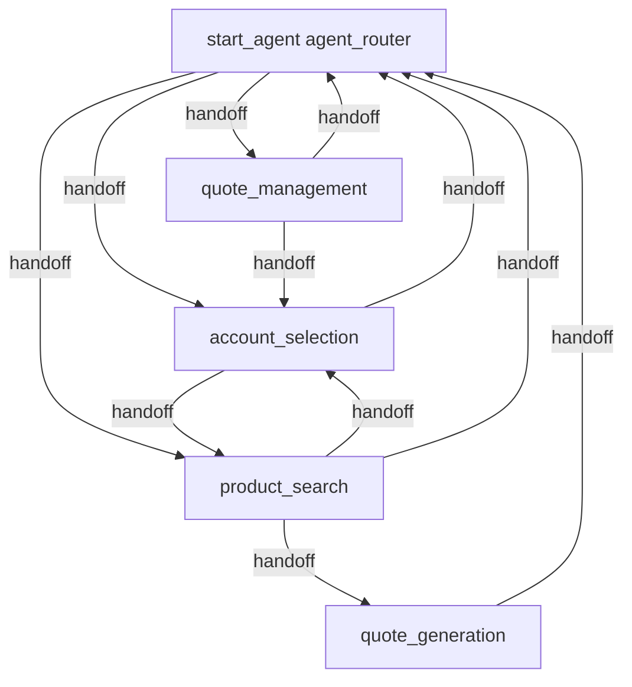

# Agent Spec: Quoting Assistant

## Purpose & Scope

The Quoting Assistant helps sales representatives create quotes by guiding them through a structured workflow: identifying the customer account, searching for products via an external pricing MCP server, generating a formatted quote with pricing, and saving the approved quote as a standard Quote record in Salesforce. It also provides quote management capabilities including history viewing and approval submission.

## Configuration

- **Agent type**: `AgentforceEmployeeAgent`
- **Default agent user**: N/A — employee agent (runs as logged-in user)
- **MCP Server**: `https://pricingmcp.onrender.com/mcp` (semantic product search + quote generation)

## Behavioral Intent

1. **Account Identification**: Search Salesforce accounts, present results, get user confirmation
2. **Product Search**: Use external MCP endpoint for semantic product search; retry with modified queries if results aren't relevant
3. **Quote Generation**: Call MCP to generate formatted quote with descriptions; present for user approval
4. **Quote Saving**: Save approved quote as a generic Quote record in Salesforce (linked to account via Opportunity, includes grand price, description with product names/quantities — no line items)
5. **Quote Management**: View history, get details, submit for approvals

## Subagent Map

## Subagents

### agent_router (start_agent)
- **Role**: Domain router
- **Purpose**: Classify user intent and route to appropriate subagent
- **Actions**: Transitions only (to account_selection, product_search, quote_management)

### account_selection
- **Role**: Domain
- **Purpose**: Search and confirm the account for the quote
- **Actions**:
  - `search_accounts` — Apex: `AccountSearchAction` — searches accounts by name (IMPLEMENTED)
  - `confirm_account` — `@utils.setVariables` — captures account_id, account_name, account_confirmed
- **Gate**: `to_products` available only when `account_confirmed == True`

### product_search
- **Role**: Domain
- **Purpose**: Search external product catalog and confirm product selections
- **Actions**:
  - `search_products` — MCP Tool: `Pricing_MCP.search_products` — semantic product search
  - `confirm_products` — `@utils.setVariables` — captures selected_products, products_confirmed
- **Gate**: `to_quote_generation` available only when `products_confirmed == True`
- **Behavior**: If search results aren't relevant, agent modifies query using domain knowledge

### quote_generation
- **Role**: Domain
- **Purpose**: Generate formal quote and save to Salesforce
- **Actions**:
  - `generate_quote` — MCP Tool: `Pricing_MCP.generate_quote` — generates formatted quote
  - `save_quote` — Apex: `SaveQuoteAction` — saves Quote record (IMPLEMENTED)
  - `approve_quote` — `@utils.setVariables` — captures quote_approved, quote_total
- **Gates**:
  - `generate` available when `products_confirmed == True and quote_approved == False`
  - `save` available when `quote_approved == True and quote_id == ""`

### quote_management
- **Role**: Domain
- **Purpose**: View history, check details, submit approvals
- **Actions**:
  - `get_quote_history` — Apex: `QuoteHistoryAction` (IMPLEMENTED)
  - `get_quote_details` — Apex: `QuoteDetailsAction` (IMPLEMENTED)
  - `submit_for_approval` — Apex: `QuoteApprovalAction` (IMPLEMENTED)

## Variables

| Name | Type | Default | Set By | Used By |
|------|------|---------|--------|---------|
| account_id | mutable string | "" | account_selection | quote_generation |
| account_name | mutable string | "" | account_selection | product_search, quote_generation |
| selected_products | mutable string | "" | product_search | quote_generation |
| quote_total | mutable string | "" | quote_generation | quote_generation (save) |
| quote_description | mutable string | "" | quote_generation | quote_generation (save) |
| quote_id | mutable string | "" | quote_generation | quote_generation |
| product_search_results | mutable string | "" | various | display |
| account_confirmed | mutable boolean | False | account_selection | product_search, gates |
| products_confirmed | mutable boolean | False | product_search | quote_generation, gates |
| quote_approved | mutable boolean | False | quote_generation | quote_generation, gates |

## Gating Logic

- **Product search** → Quote generation: Gated on `products_confirmed == True`
- **Generate quote action**: Gated on `products_confirmed == True and quote_approved == False` (prevents re-generation after approval)
- **Save quote action**: Gated on `quote_approved == True and quote_id == ""` (prevents duplicate saves)
- **Account → Products transition**: Gated on `account_confirmed == True`

## Actions & Backing Logic

| Action | Target | Backing | Status |
|--------|--------|---------|--------|
| search_accounts | apex://AccountSearchAction | Apex class with SOQL LIKE search | IMPLEMENTED |
| search_products | mcpTool://Pricing_MCP.search_products | External MCP server | EXTERNAL |
| generate_quote | mcpTool://Pricing_MCP.generate_quote | External MCP server | EXTERNAL |
| save_quote | apex://SaveQuoteAction | Creates Opportunity + Quote record | IMPLEMENTED |
| get_quote_history | apex://QuoteHistoryAction | SOQL on Quote via Opportunity.AccountId | IMPLEMENTED |
| get_quote_details | apex://QuoteDetailsAction | SOQL on single Quote record | IMPLEMENTED |
| submit_for_approval | apex://QuoteApprovalAction | Approval.process() | IMPLEMENTED |
